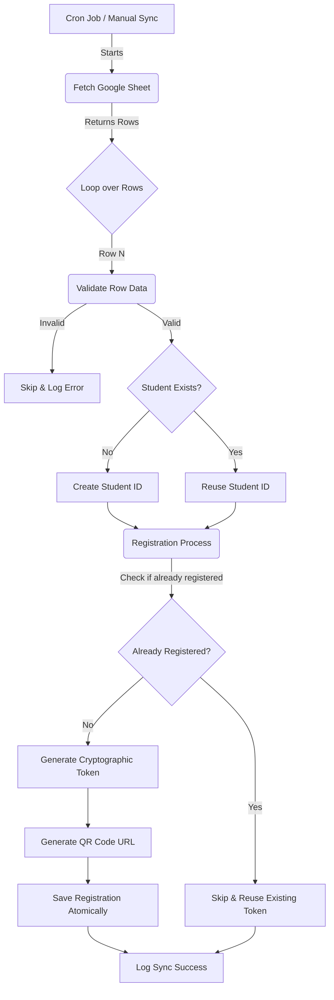
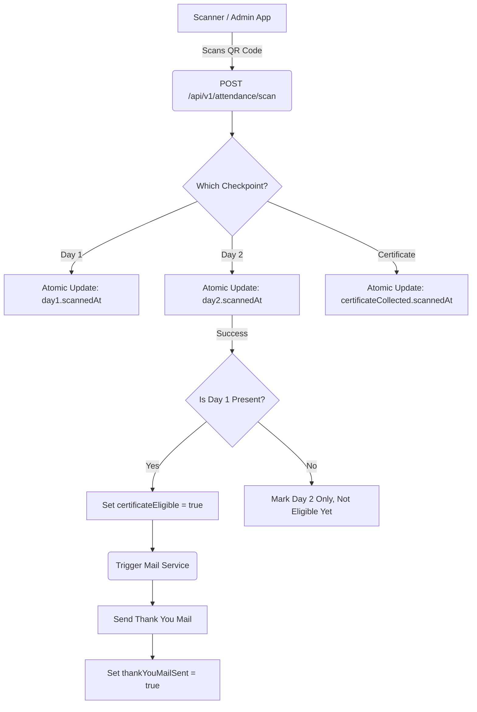

# System Workflow & Data Flow

## 1. Complete System Workflow

This diagram illustrates the chronological execution flow from the Cron Trigger to the registration logic for a 2-Day Workshop.

## 2. Checkpoint Scanning & Mail Automation Workflow

The attendance flow is split across specific checkpoints: Day 1, Day 2, and Certificate Collection.

## 3. Data Flow Between Modules

- **Cron Module (`cron/sheet-sync.cron.js`)**: Triggers the `SheetSyncService` on a defined schedule. Passes zero business logic.
- **Service Layer (`services/sheet-sync.service.js`)**: Orchestrates the sync. Uses the `GoogleSheetsProvider` to pull data. Iterates rows.
- **Service Layer (`services/registration.service.js`)**: Receives validated rows. Calls `StudentRepository.upsert()` to handle identity. Calls `TokenUtil` for tokens. Calls `RegistrationRepository.create()`.
- **Controller Layer (`controllers/attendance.controller.js`)**: Receives the scan token from the admin app. Validates scanner's JWT. Calls `AttendanceService.scan(token, checkpoint)`.
- **Service Layer (`services/attendance.service.js`)**: Passes the token to `RegistrationRepository.scanCheckpoint()`. If Day 2 completes eligibility, enqueues `MailService.sendThankYouMail()`.
- **Repository Layer (`repositories/registration.repository.js`)**: Executes atomic Mongoose `findOneAndUpdate` operations to prevent duplicate scans. Returns the updated document or null.
